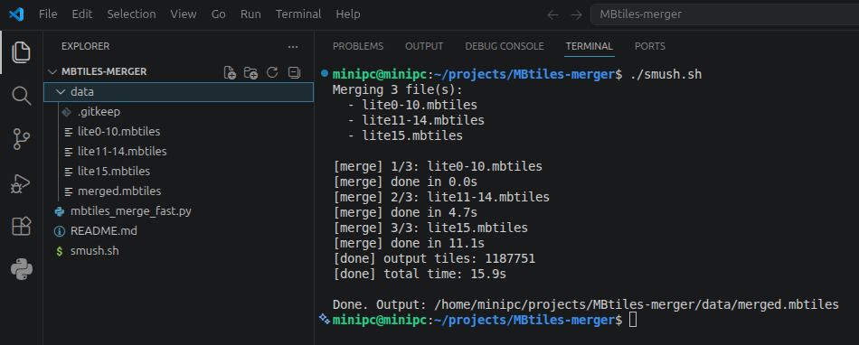

# MBTiles Fast Merger

Fast utility to merge multiple MBTiles files into one output file.

This project is optimized for a workflow where overlapping tiles exist across inputs,
but each input contributes different vector layers for the same tile coordinates.
When overlaps occur, tile payloads are concatenated in input order.

## Features

- Pure Python + SQLite (no Docker required)
- Fast SQL-based merge pipeline
- Handles overlapping tiles by concatenating `tile_data` BLOBs
- Merges key metadata fields (`minzoom`, `maxzoom`, `bounds`, `json` vector layers)

## Requirements

- Linux/macOS
- Python 3.8+
- SQLite support in Python stdlib (`sqlite3`, included by default)

## Quick Start

1. Put your `.mbtiles` files in the `data/` directory.
2. Run:

```bash
./merge.sh
```

3. Output will be written to `data/merged.mbtiles`.

## Example Output

The screenshot below shows the script running in VS Code and producing the merged MBTiles file:



## Direct CLI Usage

You can run the merger directly:

```bash
python3 mbtiles_merge_fast.py data/merged.mbtiles data/a.mbtiles data/b.mbtiles data/c.mbtiles
```

## Notes

- Input order matters for overlapping tiles because BLOBs are concatenated in the same order.
- The merger is intentionally focused on the MBTiles schema used in this repository's workflow:
  - `metadata(name TEXT, value TEXT)`
  - `tiles(zoom_level, tile_column, tile_row, tile_data, UNIQUE(...))`

## License

See `LICENCE.txt`.
